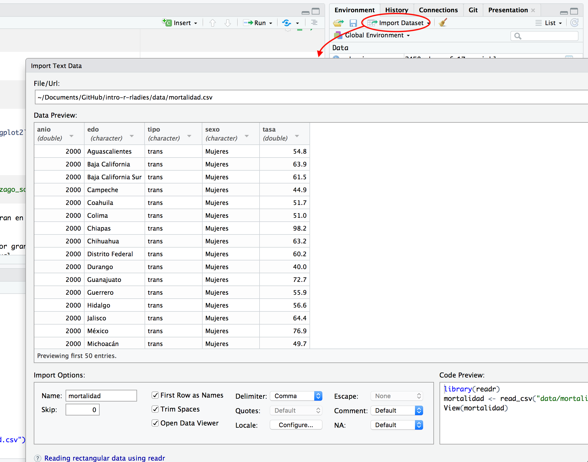

```{r setup, include=FALSE}
knitr::opts_chunk$set(echo = TRUE)
```


## ¿Qué es R? {-}

* R es un lenguaje de programación y un ambiente de cómputo estadístico
* R es software libre (no dice qué puedes o no hacer con el software), de código 
abierto (todo el código de R se puede inspeccionar - y se inspecciona).
* Cuando instalamos R, instala la base de R. Mucha de la funcionalidad adicional 
está en **paquetes** (conjunto de funciones y datos documentados) que la 
comunidad contribuye.

### ¿Cómo entender R? {-}

* Hay una sesión de R corriendo. La consola de R es la interfaz 
entre R y nosotros. 
* En la sesión hay objetos. Todo en R es un objeto: vectores, tablas, 
 funciones, etc.
* Operamos aplicando funciones a los objetos y creando nuevos objetos.

### ¿Por qué R? {-}

* R funciona en casi todas las plataformas (Mac, Windows, Linux e incluso en 
Playstation 3).
* R es un lenguaje de programación completo, permite desarrollo de DSLs.
* R promueve la investigación reproducible.
* R está actualizado gracias a que tiene una activa comunidad. Solo en CRAN hay 
más de 13,000 paquetes (funcionalidad adicional de R creadas creada por la 
comunidad).
* R se puede combinar con otras herramientas.
* R tiene capacidades gráficas muy sofisticadas.
* R es popular ([Revolutions blog](http://blog.revolutionanalytics.com/popularity/)).

## R: primeros pasos  

Para comenzar se debe descargar [R](https://cran.r-project.org), esta descarga 
incluye R básico y un editor de textos para escribir código. Después de
descargar R se recomienda descargar 
[RStudio](https://www.rstudio.com/products/rstudio/download/) (gratis y libre).


Rstudio es un ambiente de desarrollo integrado para R: incluye una consola, 
un editor de texto y un conjunto de herramientas para administrar el espacio de
trabajo cuando se utiliza R. 

Algunos _shortcuts_ útiles en RStudio son:

**En el editor**  

* command/ctrl + enter: enviar código a la consola  
* ctrl + 2: mover el cursor a la consola

**En la consola**  

* flecha hacia arriba: recuperar comandos pasados  
* ctrl + flecha hacia arriba: búsqueda en los comandos  
* ctrl + 1: mover el cursor al editor  


### Práctica: Empecemos una hora heróica!

  
<div style='font-size:50%'>(Available at [https://gph.is/2fTItW7](https://gph.is/2fTItW7), Sep 12, 2018)</div>  


## Paquetes
La mejor manera de usar R para análisis de datos es aprovechando la gran
cantidad de paquetes que aportan funcionalidad adicional.

1. Instalación de paquetes

```{r, eval = FALSE}
install.packages("readr")
```

2. Cargar paquetes

```{r}
library(readr)
```

 Instala los paquetes `ggplot2` y `dplyr`.  

&nbsp;&nbsp;&nbsp;&nbsp;&nbsp;&nbsp;&nbsp;&nbsp;&nbsp;&nbsp;&nbsp; Cárga los 
paquetes que instalaste.

### Lectura de datos

RStudio tiene un menu *poin-and-click* muy conveniente para leer tablas de 
datos, permite importar archivos en varios formatos comunes:

* csv: archivos de texto separados por comas (cualquier hoja de excel se puede
exportar como csv).

* excel

* SPSS

* SAS

* Stata



**OJO:** Es importante asegurarse de copiar a nuestro script la instrucción que se genera 
al importar archivos con las herramientas de RStudio.

3. Leer datos: la siguiente instrucción lee un archivo csv y lo asigna a una 
variable llamada cohesión social.


```{r}
cohesion_rezago <- read_csv("data/cohesion_rezago_social.csv")
```

4. Ver los datos: la función `head()` imprime las primeras líneas de los datos.

```{r}
head(cohesion_rezago)
```


 Lee los datos de mortalidad que se encuentran en la 
carpeta `data`.

## Graficación

Utilizaremos el paquete `ggplot2` que fue desarrollado por Hadley Wickham. 

```{r}
library(ggplot2)
```

5. Gráficas de dispersión

```{r, fig.width = 4, fig.height = 4}
ggplot(data = cohesion_rezago) + 
  geom_point(mapping = aes(x = Viviendas_sin_lavadora, y = Viviendas_sin_refrigerador)) 
```

¿Qué pasó? 

`ggplot(data = cohesion_rezago) + geom_point(mapping = aes(x = Viviendas_sin_lavadora, y = Viviendas_sin_refrigerador))`
    
* En ggplot2 se inicia una gráfica con la instrucción `ggplot()`.

* Especificamos explicitamente que base de datos usamos, este es el primer 
argumento en la función ggplot. 

`ggplot(data = cohesion_rezago)`

* Después añadimos *capas*, y dentro de *aes()* escribimos las variables que 
queremos graficar y el atributo de la gráfica al que queremos mapearlas. 

`geom_point(aes(x = Viviendas_sin_lavadora, y = Viviendas_sin_refrigerador))`

* En este caso la función `geom_point()` añade una capa de puntos, hay muchas 
funciones *geometrías* incluídas en ggplot2: `geom_line()`, 
`geom_boxplot()`, `geom_histogram`,... 

* En el ejemplo de arriba mapeamos `Viviendas_sin_lavadora` al eje x, 
`Viviendas_sin_refrigerador` al eje y, pero `geom_point()` nos 
permite representar más variables usando la forma, color y/o tamaño del punto.
Esta flexibilidad nos permite entender o descubrir patrones más interesantes en 
los datos.

```{r, fig.width = 6, fig.height = 4}
ggplot(data = cohesion_rezago) + 
  geom_point(mapping = aes(x = Viviendas_sin_lavadora, 
      y = Viviendas_sin_refrigerador, color = Grado_de_polarizacion)) 
```

 Experimenta con los _aesthetics_ color (color), 
tamaño (size) y forma (shape).

&nbsp;&nbsp;&nbsp;&nbsp;&nbsp;&nbsp;&nbsp;&nbsp;&nbsp;&nbsp;&nbsp;  ¿Qué 
diferencia hay entre las variables categóricas y las continuas?

&nbsp;&nbsp;&nbsp;&nbsp;&nbsp;&nbsp;&nbsp;&nbsp;&nbsp;&nbsp;&nbsp;  ¿Qué ocurre 
cuando combinas varios _aesthetics_?

El mapeo de las propiedades estéticas se denomina escalamiento y depende del 
tipo de variable, las variables discretas (por ejemplo, genero, escolaridad, 
país) se mapean a distintas escalas que las variables continuas (variables 
numéricas como edad, estatura, etc.), los *defaults* para algunos atributos son
(los escalamientos se pueden modificar):


aes       |Discreta      |Continua  
----------|--------------|---------
Color (`color`)|Arcoiris de colores         |Gradiente de colores  
Tamaño (`size`)  |Escala discreta de tamaños  |Mapeo lineal entre el área y el valor  
Forma (`shape`)    |Distintas formas            |No aplica
Transparencia (`alpha`) | No aplica | Mapeo lineal a la transparencia   

6. Más tipos de gráficas:

```{r, fig.width = 5, fig.height = 4}
ggplot(cohesion_rezago, aes(x = Viviendas_sin_lavadora, 
      y = Viviendas_sin_refrigerador)) + 
    geom_line() 
```
No es una buena gráfica!

 ¿Cómo podemos mejorar la siguiente gráfica?

```{r, fig.width = 3.5, fig.height = 3.5}
mortalidad <- read_csv("data/mortalidad.csv")
ggplot(mortalidad, aes(x = anio, y = tasa)) +
    geom_point()
```

Color?

```{r, fig.width = 4, fig.height = 3.5}
ggplot(mortalidad, aes(x = anio, y = tasa, color = sexo)) +
    geom_point()
```

Podemos probar otros geoms.

```{r, fig.width = 5, fig.height = 4}
ggplot(mortalidad, aes(x = factor(anio), y = tasa, color = sexo)) +
    geom_boxplot() 
```

 ¿Cómo esta relacionado el índice de rezago y la población?

```{r, eval=FALSE, echo=FALSE}
ggplot(cohesion_rezago, aes(x = Poblacion, y = Indice_rezago_social)) +
    geom_point()
ggplot(cohesion_rezago, aes(x = Poblacion, y = Indice_rezago_social)) +
    geom_point(alpha = 0.5) +
    scale_x_log10() + 
    geom_smooth(method = "lm")
```

Veamos ahora como hacer gráficas de paneles, la idea es hacer varios múltiplos 
de una gráfica donde cada múltiplo representa un subconjunto de los datos, es 
una práctica muy útil para explorar relaciones condicionales.

7. Podemos usar _facet\_wrap()_ para hacer paneles dividiendo los datos 
de acuerdo a las categorías de una sola variable:

```{r, fig.width = 6, fig.height = 4}
ggplot(mortalidad, aes(x = factor(anio), y = tasa, color = sexo)) +
    geom_boxplot() +
    facet_wrap(~ tipo)
```

Pero... ¿qué queremos ver?

```{r}
ggplot(mortalidad, aes(x = factor(anio), y = tasa, color = sexo, group = edo)) +
    geom_path(alpha = 0.5) +
    facet_grid(reorder(tipo, tasa) ~ sexo, scales = "free_y")
```

Y con unas mejoras: 

```{r, message=FALSE}
library(dplyr)
mortalidad_2008 <- filter(mortalidad, anio == 2008)
mortalidad_2008_gpd <- group_by(mortalidad_2008, tipo, sexo)
edos_mortalidad_mayor <- top_n(mortalidad_2008_gpd, 1, tasa)
edos_mortalidad_menor <- top_n(mortalidad_2008_gpd, 1, -tasa)


ggplot(data = mortalidad, aes(x = factor(anio), y = tasa, color = sexo, 
    group = edo)) +
    geom_path(alpha = 0.5) +
    geom_text(data = edos_mortalidad_mayor, aes(x = factor(anio), y = tasa, 
        label = edo), size = 2.5, hjust = 1, vjust = 0, color = "black") +
    geom_text(data = edos_mortalidad_menor, aes(x = factor(anio), y = tasa, 
        label = edo), size = 2.5, hjust = 1, vjust = 0, color = "black") +
    facet_grid(tipo ~ sexo, scales = "free_y") +     
    theme(axis.text.x = element_text(angle = 90, hjust = 1))

```

## Manipulación

8. Filtrar: nos permite obtener un subconjunto de los datos:

```{r}
filter(cohesion_rezago, Grado_rezago_social == "Muy alto")
```

* Algunos operadores importantes para filtrar son:  

```{r, eval = FALSE}
x > 1
x >= 1
x < 1
x <= 1
x != 1
x == 1
x %in% c("a", "b")
```


* El primer argumento de `filter()` es el nombre del *data frame*, los subsecuentes 
son las expresiones que indican que filas filtrar.

 Selecciona los municipios correspondientes al estado en que
naciste.

&nbsp;&nbsp;&nbsp;&nbsp;&nbsp;&nbsp;&nbsp;&nbsp;&nbsp;&nbsp;&nbsp; Selecciona los
municipios correspondientes al estado en que naciste y con grado de rezago 
social menor a -1.

&nbsp;&nbsp;&nbsp;&nbsp;&nbsp;&nbsp;&nbsp;&nbsp;&nbsp;&nbsp;&nbsp; Filtra los
municipios con población mayor a 1 millón.

9. Mutar consiste en crear nuevas variables aplicando una función a columnas 
existentes:

```{r}
mutate(cohesion_rezago, Pob_miles = Poblacion / 1000) 
```

 Calcula el número de personas en pobreza extrema
en cada municipio.

10. Resumir: Crear valores con la información en las columnas de la base de 
datos:

```{r}
summarise(cohesion_rezago, media_pob = mean(Poblacion, na.rm = TRUE))
```

```{r}
summarise(cohesion_rezago, media_pob = mean(Poblacion, na.rm = TRUE), 
    mediana_pob = mean(Poblacion, na.rm = TRUE), 
    min_pob = min(Poblacion, na.rm = TRUE), 
    max_pob = max(Poblacion, na.rm = TRUE))
```

 ¿Cuál es el promedio de analfabetismo municipal?  
&nbsp;&nbsp;&nbsp;&nbsp;&nbsp;&nbsp;&nbsp;&nbsp;&nbsp;&nbsp;&nbsp; ¿Cuántos
analfabetas hay en México?  
&nbsp;&nbsp;&nbsp;&nbsp;&nbsp;&nbsp;&nbsp;&nbsp;&nbsp;&nbsp;&nbsp; ¿Cuántos
analfabetas hay en tu estado?  
&nbsp;&nbsp;&nbsp;&nbsp;&nbsp;&nbsp;&nbsp;&nbsp;&nbsp;&nbsp;&nbsp; ¿Cuántos
municipios clasifican en alto rezago social?

### ¡Demasiada información!

Aprender algo nuevo es difícil e intimidante, para todos!

  

Pero el dolor pasa :D


<div style='font-size:50%'>(Available at [https://gph.is/1LjlEFE](https://gph.is/1LjlEFE), Sep 13, 2018)</div>  


## Recursos {-}
Existen muchos recursos gratuitos para aprender R, y resolver nuestras dudas, 
enlistamos algunos.

* El libro [R for Data Science](http://r4ds.had.co.nz/) gratuito de Hadley Wickham.  
* [Datacamp](https://www.datacamp.com/) cuentan con excelentes cursos 
interactivos.
* Buscar ayuda: Google, [StackOverflow](http://stackoverflow.com/questions/tagged/r).  
* Para aprender más sobre un paquete o una función pueden visitar [Rdocumentation.org](http://www.rdocumentation.org/).    
* Para aprender programación avanzada en R, el libro gratuito 
[Advanced R](http://adv-r.had.co.nz) de Hadley Wickham es una buena referencia.
* Para mantenerse al tanto de las noticias de la comunidad de R pueden visitar 
[R-bloggers](http://www.r-bloggers.com).  


## Datos {-}

* [Rezago social](https://www.coneval.org.mx/Medicion/IRS/Paginas/Que-es-el-indice-de-rezago-social.aspx): estimaciones del CONEVAL con base en el XII Censo de 
Población y Vivienda 2000, II Conteo de Población y Vivienda 2005, Censo de 
Población y Vivienda 2010 y Encuesta Intercensal 2015.

* [Cohesión social](https://www.coneval.org.mx/Medicion/Paginas/Cohesion_Social.aspx): estimaciones del CONEVAL con base en el MCS-ENIGH 2010 y la 
muestra del Censo de Población y Vivienda 2010.

* [Mortalidad](http://www.inegi.org.mx/sistemas/olap/Proyectos/bd/continuas/mortalidad/MortalidadGeneral.asp) Datos de mortalidad general INEGI.

